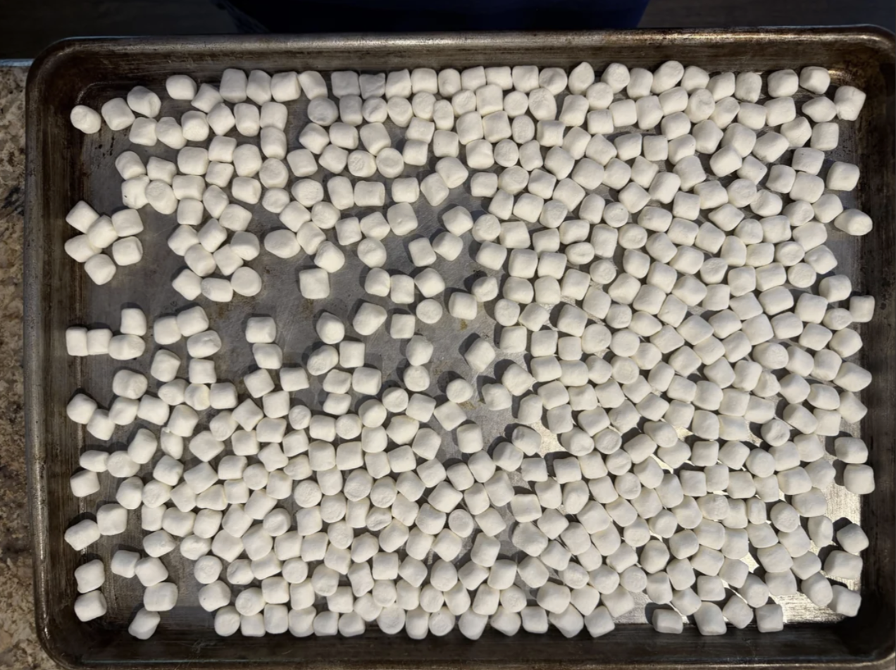
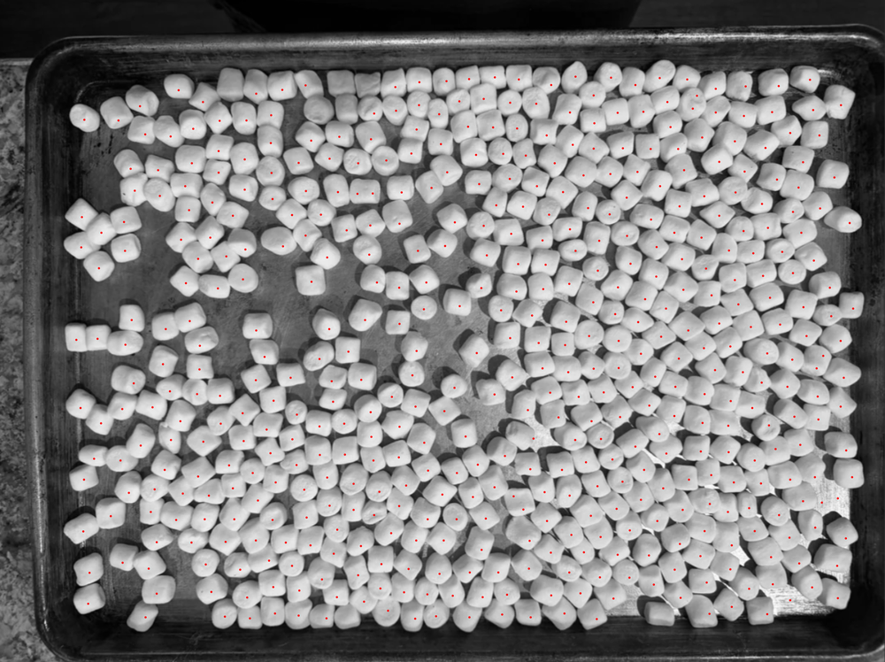

# Counting mini marshmallows

Counting the marshmallows on a baking sheet with classical computer vision, then
checking the answer three different ways.



**Answer: 506.** Three methods with different failure modes converged here, and two of
them agree marshmallow-by-marshmallow, not just in total. So I feel pretty confident (99%+) that 506 is the answer.



| method | count | independent? |
| --- | --- | --- |
| watershed, sweep as originally specified | 480.5, range [404, 507] | yah |
| watershed, `min_distance` set to the measured half-diameter | 506 | yah |
| careful hand count via `clicker.html` | 506 | **naw** — seeded from the detector |
| Cellpose (`cellpose_count.py`) | 506 | yah |

The original hand count of 484 was 22 low, which is the expected direction for a
human counting ~500 densely packed identical objects.

## The pipeline

`count.py` — threshold → binary opening → Euclidean distance transform →
`peak_local_max` markers → marker-controlled watershed → area filter.

```
python count.py
```

Prints the parameter sweep, and writes `overlay.png` (a dot per marshy boi detection) and
`segments.png` (watershed labels, random colormap) at the configuration closest to the
the sweep median. `--render 175 14` will render the 506 configuration instead
(which is how `overlay_506.png` above was made but downscaled to 1000px).

## What the method does, and why it still goes wrong

**The systematic error runs low bc of `min_distance`.**

The brief swept `min_distance` over {14, 16, 18, 20, 22}. Errors against 506:

```
thresh \ min_dist |    14     16     18     20     22
------------------------------------------------------
              165 |    +1    -7   -12   -25   -44
              175 |     0    -7   -13   -26   -59
              185 |   -11   -18   -25   -42   -67
              195 |   -27   -41   -49   -71  -102
```

...so 19 of 20 cells undercount. But the method isn't at fault so much as the grid is. If we extend
the sweep below 14 (`analysis/min_distance_curve.py`) and the curve is monotonic,
crossing 506 at `min_distance` 13–14 and over-splitting badly below it (632 at
md=6) the swept range starts at the optimum and moves away from it in one
direction so every other cell merges touching marshmallows under a single marker.

The measured half-diameter is **14.7 px**. The principled rule — `min_distance` being about
half a marshmallow — was correct the whole time but it needed to be the **center** of
the sweep instead of bieng its floor. Sweeping 11→19 would have put the median near 506
instead of 480.5.

Threshold is the weaker, secondary thing to note here; it acts by setting where on each
marshmallow's soft edge the blob gets cut, which changes apparent size of each marshy boi:

| threshold | measured equivalent diameter |
| --- | --- |
| 165 | 34.5 px |
| 175 | 32.8 px |
| 185 | 30.3 px |
| 195 | 26.8 px |

At high thresholds, marshmallows clipped by the tray wall shrink under the
40%-of-median area filter and get discarded — one bottom-edge strip drops from 28
detections to 21 between t=165 and t=195.

## Things that turned out not to be the problem at all!

Each of these has a script under `analysis/` that reproduces the finding.

**Pan/marshmallow brightness overlap** — `brightness_separability.py`.
Pan p99.5 = 161, marshmallow-interior p5 = 186. These are cleanly separable and only 0.39% of
pan pixels clear the lowest swept threshold. (An earlier version of this check used
hand-drawn rectangles that included gap and shadow pixels, and reached the opposite
(read: wrong) conclusion. Measure the thing you mean to measure.)

**Uneven illumination** — `illumination_fit.py`.
Fitting a quadratic surface to all 506 marshmallow tops gives R² = 0.070, spanning
just 14 gray levels across the whole frame. Model selection by held-out R² shows
train R² climbing to 0.158 at 6th order while held-out R² peaks at cubic (0.064)
and then *falls* — textbook overfitting. Even the winner barely beats predicting the
mean (RMSE 9.25 vs 9.56). **The correct illumination model for this photo is a
constant.** Flat-fielding would do nothin.

**Gaussian blur** — `blur_ablation.py`.
Blurring the grayscale barely moves anything (note that the image is already high-SNR).
Blurring the distance transform makes things actively worse: spread widens 59→74
and error at md=18 goes from −13 to −33. Blur flattens small local maxima, which is
to correct for over-segmentation; the saddle between two touching marshmallows is
an example of such a maximum so blur there destroys the evidence that there were two objects.

**Thresholding alone** — `watershed_contribution.py`.
Threshold + opening at t=175 yields 242 blobs, less than half the answer. 
At t=165 the largest single connected component contains about **160 touching 
marshmallows**. The watershed really doing the bulk of the work here.

## Verifying by hand

`clicker_template.html` + `build_clicker.py` produces a standalone click-to-count
page that preloads the detector's markers, so you correct what the count already is rather than
count from zero. A 6×4 grid with live per-cell tallies keeps you from losing your
place and you press `D` to tick a cell done and `H` to hide markers and see the bare photo.
It also every coordinate as CSV.

```
python build_clicker.py && open clicker.html
```

**Caveat:** seeding the tool with the detector's output anchors the
human. A hand count produced this way is basically just a correction pass
and was most of the reason it made sense to me to proceed with Cellpose.

## The ML cross-check

```
pip install cellpose
python cellpose_count.py --truth hand_count.csv
```

Cellpose predicts a flow vector pointing toward its object's center and then groups pixels that converge
on the same point.

It returns **506**, with zero masks dropped by the area filter.

`analysis/agreement.py` matches the two point sets one-to-one:

```
matched within 15px: 498
  classical-only: 8
  cellpose-only : 8
  centre offset among matches: median 4.8px, p95 9.5px
agreement rate: 98.4%
```

The identical totals are nice but not necessarily perfect proof. Some of the overlap can 
be comfortably chalked up to luck. But twas fun!

## Layout

```
count.py                 the classical pipeline + parameter sweep
cellpose_count.py        independent ML cross-check, scored as precision/recall
build_clicker.py         bakes image + markers into the standalone clicker
clicker_template.html    clicker source (the built .html is gitignored)
analysis/                one script per claim made above
```

## Setup

```
python3 -m venv .venv
./.venv/bin/pip install -r requirements.txt
```

`cellpose` is optional and commented out. it pulls PyTorch and downloads a 1.2GB
checkpoint on first run. don't put it back unless you want a big boi checkpoint.
